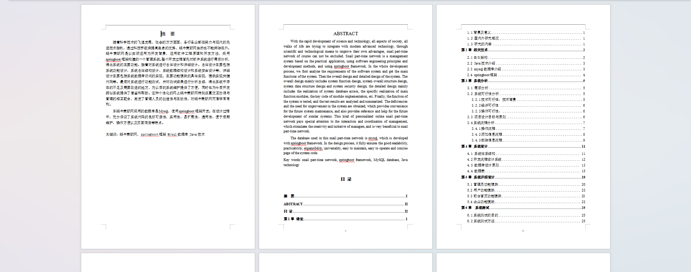
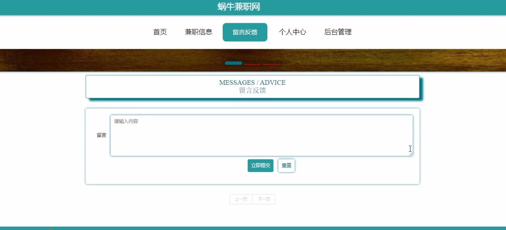
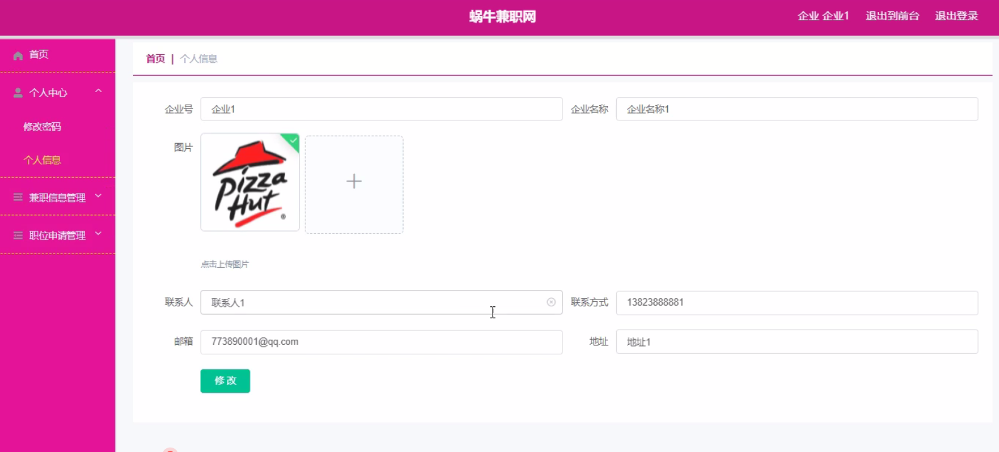
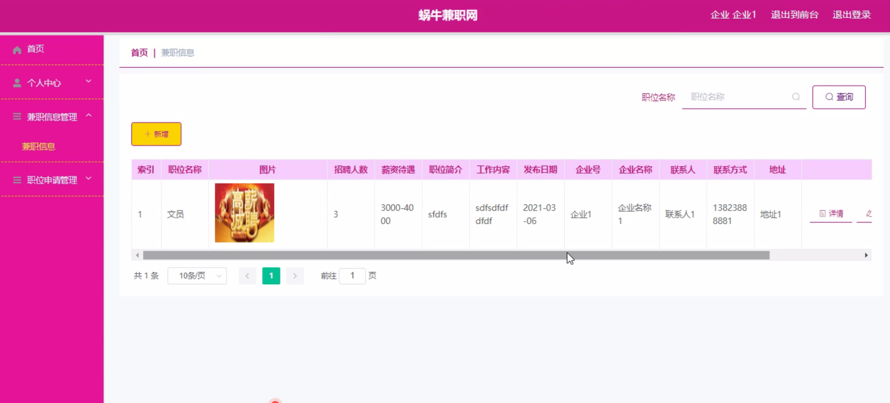
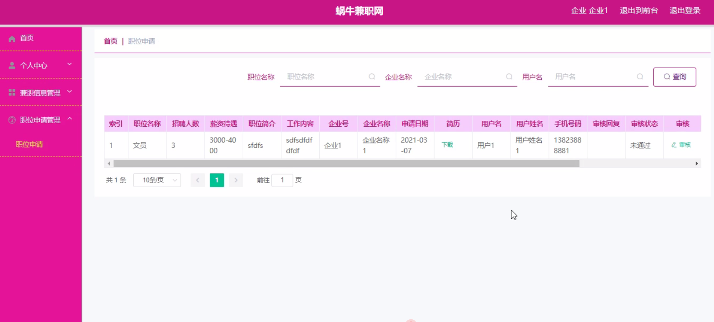

基于Springboot的蜗牛兼职网（程序+论文）
=
### 完整代码获取地址：从戎源码网 ([https://armycodes.com/](https://armycodes.com/))
### 作者微信：19941326836  QQ：952045282 
### 承接计算机毕业设计、Java毕业设计、Python毕业设计、深度学习、机器学习
### 选题+开题报告+任务书+程序定制+安装调试+论文+答辩ppt 一条龙服务
### 所有选题地址https://github.com/nature924/allProject

一、项目介绍
---
系统包含两种角色：用户、管理员，系统分为前台和后台两大模块，主要功能如下：

### 1。管理员功能模块
管理员登录时，通过填写用户名、密码、角色进行登录。

登录后，管理员可以访问首页、个人中心、用户管理、企业管理、兼职信息管理、职位申请管理、留言板管理、系统管理等功能模块。

- 用户管理  
  在用户管理页面中，管理员可以通过填写用户名、密码、用户姓名、头像、性别、手机号码、邮箱等信息进行查看详情、修改、删除等操作。同时，也可以对企业管理进行详情、修改或删除等操作。

- 企业管理  
  管理员可以查看和管理企业的详细信息，包括企业的基本资料和管理操作。

- 兼职信息管理  
  管理员可以查看兼职职位名称、图片、招聘人数、薪资待遇、职位简介、工作内容、发布日期、企业号、企业名称、联系人、联系方式等信息，并进行详情、修改或删除操作。

- 职位申请管理  
  在职位申请管理页面中，管理员可以查看职位名称、招聘人数、薪资待遇、职位简介、工作内容、企业号、企业名称、申请日期、简历、用户名、用户姓名、手机号码、审核回复、审核状态等信息，并进行详情、修改或删除操作。

- 留言板管理  
  在留言板管理页面，管理员可以查看用户名、留言内容、回复内容等信息，并进行详情、回复、修改或删除操作。

- 轮播图管理  
  管理员可以在轮播图管理页面进行首页轮播图的管理，包括添加新图片、修改已有图片及删除图片操作。

### 2.用户功能模块
用户登录后，填写用户名、密码进行登录。

登录后，用户可以访问首页、个人中心、职位申请管理等功能模块。

- 职位申请管理  
  用户可以在职位申请管理页面查看职位名称、招聘人数、薪资待遇、职位简介、工作内容、企业号、企业名称、申请日期、简历、用户名、用户姓名、手机号码、审核回复、审核状态等信息，并进行详情、修改或删除操作。

### 前台首页功能模块
在蜗牛兼职网的首页，用户可以查看首页、兼职信息、留言反馈、个人中心、后台管理等内容。

- 用户登录  
  用户通过填写用户名、密码进行登录。

- 兼职信息  
  在兼职信息页面，用户可以查看职位名称、图片、招聘人数、薪资待遇、职位简介、工作内容、发布日期、企业号、企业名称、联系人、联系方式等信息，并进行下载操作。

- 留言反馈  
  用户可以在留言反馈页面填写留言内容，进行立即提交或重置等操作。

## 3.企业功能模块
企业登录后，填写用户名、密码、角色进行登录。

登录后，企业可以访问首页、个人中心、兼职信息管理、职位申请管理等功能模块。

- 个人信息  
  企业在个人信息页面可以填写企业号、企业名称、图片、联系人、联系方式、邮箱、地址等信息，并根据需要对个人信息进行修改。

- 兼职信息管理  
  企业可以在兼职信息管理页面填写职位名称、图片、招聘人数、薪资待遇、职位简介、工作内容、发布日期、企业号、企业名称、联系人、联系方式等信息，并进行详情、修改或删除操作。

- 职位申请管理  
  企业可以在职位申请管理页面填写职位名称、招聘人数、薪资待遇、职位简介、工作内容、企业号、企业名称、申请日期、简历、用户名、用户姓名、手机号码、审核回复、审核状态等信息，并进行详情、修改操作。

二、项目技术
---
- 编程语言：Java
- 数据库：MySQL
- 项目管理工具：Maven
- 前端技术：VUE、HTML、Jquery、Bootstrap
- 后端技术：Spring、SpringMVC、MyBatis

三、运行环境
---
- 操作系统：Windows、macOS都可以
- JDK版本：JDK1.8以上都可以
- 开发工具：IDEA、Ecplise、Myecplise都可以
- 数据库: MySQL5.7以上都可以
- Tomcat：任意版本都可以
- Maven：任意版本都可以

四、运行截图
---
### 论文截图：

### 程序截图：

